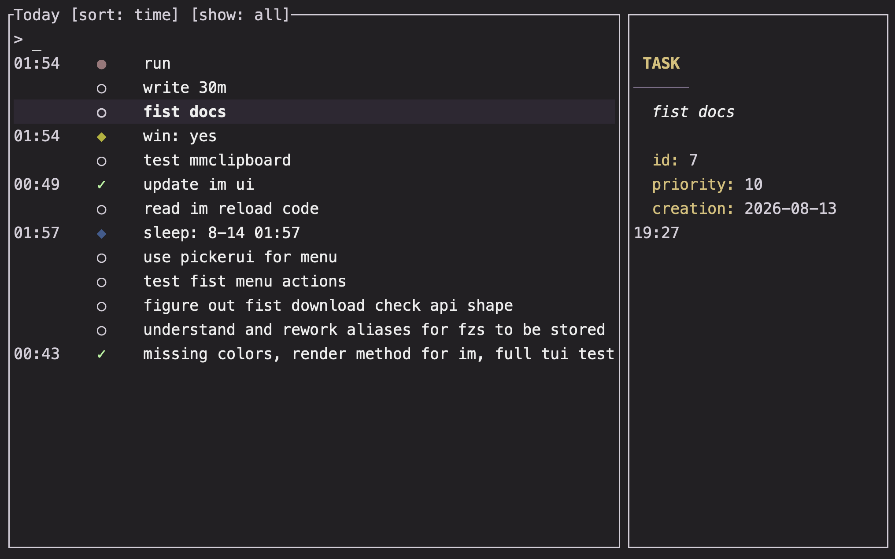

# [Im](https://www.youtube.com/watch?v=Ts0XSyWpMnU)

`im` is a CLI tool for recording all the small moments, feelings, thoughts and setbacks and accomplishments that make up your day[^1].

```shell
# record moods and notes
im playing chess against stockfish and im winning  # mood
im confused . why did i lose?                      # mood + note
im . turns out i was playing antichess             # note

im worried about school tomorrow
im sad that my dog ate my bones
im sorry that my cat ate my dog

im abe on the next level
im abe rockin over that base treble
im aswing it this way
im aswing it that-a-way

# a trailing . opens your editor for writing the note
im terrified that someone will see me writing this down .

# add a task

# build habits with recurring tasks

# schedule future events

# show today's agenda
im @due | cat

# log custom trackers
im full -food 7
im going to bed -sleep -acc finished blog post
im still up -sleep
im still up -sleep

# visualize your progress
im :

im :month pet_cat cat_food_spend wins

# reflect and repeat
im still alive . i think
```

## Features

- Log moods and journal entries in simple, natural syntax.
  - Today view: show a ordered summary of all that you have logged and planned today -- an interactive, auto-generated daily note. 
- Grid view: Display your mood, task and tracker histories as dots.
  - Moods are colored by how much they match to various emotions or topics you have configured.
  - Change the topics, timespans, and filters, and watch as interesting patterns emerge.
- Task Management: Support for oneshot, recurring tasks and scheduled tasks.
  - Interactive views over upcoming / completed / due tasks.
  - Full featured data model supporting priorities, subtasks, optional tasks, overdue tasks and multiple completions.
- Custom Trackers: Track custom metrics with configurable intervals, ranges and colors.

## Gallery




## Usage

<!-- HELP_START -->
```
im — immediate mood, journal, and task tracker

Usage:
  im <mood> [. [body]]                           log a mood (with an optional body)
  im [-tracker <value>]...                       add one or more custom tracker records
    [mood] [-tracker <value>]...                        (optionally linked to a new mood entry)

  im ! [-<parent_id>] [. body]                   create a oneshot task (interactive)
  im ! <name> [@<time>]                          create a oneshot task
  im ! @ [name]                                  create a recurring task (interactive)
  im ! @<time> [:name] [%duration]               create a scheduled task 
                                                        (interactive if partial)

  All the previous subcommands support a trailing [. [body]].
  If only . is specified, `$EDITOR` will open for writing the body of the
  entry (more dots — .., ... — select a configured template per entry
  kind; out of range falls back to the hint line).

  Oneshot tasks can be optionally linked to a parent (i.e. subtasks)
  by writing the parent's id prefixed with `-` in the first argument.
    A bare - allows you to pick the parent interactively.

Views:
  im @[date]                                     today view
  im @due[:t|:w]                                 due view
                                                        (today / tomorrow / this week)
  im @[:o|:O]                                    pending tasks
                                                        (all / oneshot / recurring+scheduled)
  im @done[:o|:O]                                completed tasks

Trackers and grids:
  im :[week|month|year] [ids]                    dot-sequence tracker grid
                                                        ids: <tracker> or @<recurring-name>
                                                        period defaults to "week"

Cli actions:
  im - <query words> [count]                     update completion of the unique task
                                                        whose name contains <query words>
                                                        in their order
  im - <id> [count]                              update task completion by id

Other:
  im :config | :c                                open the config in $VISUAL / $EDITOR
  im :moods                                      open the moods config file
  im :embed                                      embed stdin lines (one vector/line)
  im :color <mood>                            projected mood color diagnostic
  im :clear [@date]                              clear all mood entries from a day
  im :db prune                                   delete completed and expired tasks
  im :db backfill                                compute and persist missing mood embeddings
  im :db doctor                                  check tracker entries vs kinds; prune mismatches

Flags:
  im -q | -v <command>                           quiet / verbose; flags go first
  im --help | -h                                 show this help
```
<!-- HELP_END -->

## Installation

##### Homebrew

```sh
brew install Squirreljetpack/tap/im
```

##### AUR

Unavailable

##### npm

```sh
npm install -g @squirreljetpack/im
```

## Configuration

Run `im :config` to open the configuration file in your `$EDITOR` or `$VISUAL`.

The default locations are in order:

- `~/.config/matchmaker/config.toml` (If the folder exists already).
- `{PLATFORM_SPECIFIC_CONFIG_DIRECTORY}/matchmaker` (Generally the same as above when on linux)

## Trackers

Trackers are defined in your configuration (`im :config`); each `[tracker.<name>]`
section is logged as `-<name> <value>` (no value for `null` trackers):

- Kinds: `text` (value stored verbatim), `integer` (whole numbers), `float`
  (plain numbers), `duration` (duration strings like `6m 30s`, stored and
  displayed as time), `null` (valueless timestamp/count markers — requires an
  interval).
- Value forms are strict per kind: `-rating 4h` on a `float` tracker, `-mile
  390` on a `duration` tracker, and any value on a `null` tracker are errors.
- `interval = { anchor = "2026-01-01T00:00:00-04:00", span = "1 day" }` (or
  the legacy `["2026-01-01T00:00:00-04:00", "1 day"]` array form) bins
  entries into calendar slots. By default (replace) a new log in a slot
  replaces the slot's previous entry; `cumulative = true` keeps every log and
  the slot's grid dot shows the sum (or count, for `null`).
- `low`/`high` pick the grid dot color (see the inline docs in the default
  config). With `strict = true` they also gate logging: values (numeric
  kinds), message length in characters (`text`), or — for `null` trackers —
  the time of day must fall inside the configured range.

## Advanced

[`im`](https://www.youtube.com/watch?v=xP26YedHWxc) stores three types of objects:
  - moods entries: which compute an embedding that captures their semantic meaning.
  - tasks: oneshot, recurring, or scheduled.
  - trackers: defined in your configuration.

##### Trackers

Trackers are defined in your configuration (`im :config`); each `[tracker.<name>]`
section is logged as `-<name> <value>` (no value for `null` trackers):

- Kinds: `text` (value stored verbatim), `integer` (whole numbers), `float`
  (plain numbers), `duration` (duration strings like `6m 30s`, stored and
  displayed as time), `null` (valueless timestamp/count markers — requires an
  interval).
- `interval = { anchor = "2026-01-01T00:00:00-04:00", span = "1 day" }` bins
  entries into calendar slots. By default (replace) a new log in a slot
  replaces the slot's previous entry; `cumulative = true` keeps every log and
  the slot's grid dot shows the aggregate.

## FAQ

### Why is the binary size so large?

`im` bundles a quant of `nomic-ai/nomic-embed-text-v1.5` to categorize your entries. This was the most effective, reasonably sized approach tested out of several options. The size is a bit abnormal, but was pleasantly surprised with how much better it worked compared to my other attempts. If you have any interesting uses for an embedding model that `im` can help with, `im` open to them!

### What does im stand for?

What it stands for is immaterial[^2].

### How can I contribute?
Open to suggestions. Helping implement more filters, or a sensible configurable spec for exporting to markdown would be helpful. Documentation, always.

## See also

- https://github.com/qiz-li/im
- https://docs.rs/jiff/latest/jiff/


[^1]: `im` can also help you:
    - catalogue all the goals and hopes you never got around to
    - all the tasks you missed the deadline for
    - reinforce negative thoughts
    - rationalize bad decisions
    - realize that you don't actually have any thoughts interesting enough to write down.

[^2]: important, immense, immaculate, importune, imagine all the people .. immolated♫